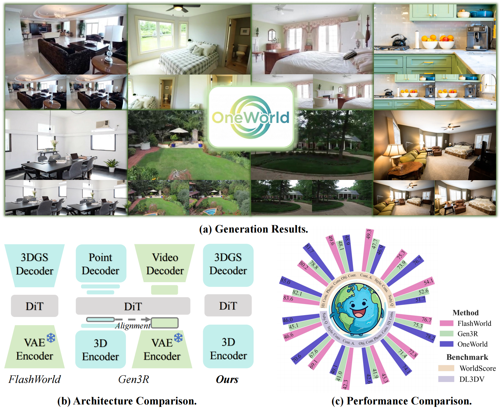

<div align="center">
<h1>OneWorld: Taming Scene Generation with 3D Unified Representation Autoencoder</h1>

[Sensen Gao\*](https://sensengao.github.io/), [Zhaoqing Wang\*](https://derrickwang005.github.io/), [Qihang Cao](https://scholar.google.com/citations?user=oegbT6AAAAAJ&hl=zh-CN), [Dongdong Yu](https://scholar.google.com/citations?user=B2RmjSYAAAAJ&hl=zh-CN), [Changhu Wang](https://scholar.google.com/citations?user=DsVZkjAAAAAJ&hl=en), [Tongliang Liu📧](https://tongliang-liu.github.io/), [Mingming Gong📧](https://mingming-gong.github.io/), [Jiawang Bian📧](https://jwbian.net/)

<a href="https://arxiv.org/abs/2603.16099"></a>
<a href="https://sensengao.github.io/OneWorld/"></a>
<a href="https://github.com/SensenGao/OneWorld"></a>
<a href="https://huggingface.co/Sensen02/OneWorld"></a>
<a href="https://huggingface.co/datasets/Sensen02/NVS-Refined"></a>

<p align="center">
  <a href="https://sensengao.github.io/OneWorld/">
    
  </a>
</p>

<p align="left">
<strong>TL;DR</strong>: <strong>OneWorld generates a camera-controllable 3D Gaussian scene from a single image</strong> by learning a unified representation of geometry and appearance in the feature space of a pretrained 3D foundation model.
</p>

<p align="left">
<strong>Training code</strong> is in <a href="train/"><code>train/</code></a>, <strong>inference code</strong> is in <a href="infer/"><code>infer/</code></a>, and the <strong>released four-step weights</strong> are on <a href="https://huggingface.co/Sensen02/OneWorld">Hugging Face</a>.
</p>
</div>

## 🚀 Code

| | what it contains |
|---|---|
| **[`train/`](train/)** | RAE, DiT+CVC, MDF joint decoder training, and four-step 3DGS-feedback distillation. [Guide →](train/README.md) |
| **[`infer/`](infer/)** | image + camera inference with optional text, multi-view image export, and 3DGS render video export. [Guide →](infer/README.md) |

### Weights

Download the released model and its two external backbones:

```bash
huggingface-cli download Sensen02/OneWorld \
    --local-dir weights/OneWorld
huggingface-cli download Wan-AI/Wan2.1-T2V-1.3B \
    --local-dir weights/Wan2.1-T2V-1.3B
huggingface-cli download yyfz233/Pi3X \
    --local-dir weights/Pi3X
```

Install the [Pi3](https://github.com/yyfz/Pi3) Python source in the same environment, or add its repository root to `PYTHONPATH`:

```bash
export PYTHONPATH=/path/to/Pi3:$PYTHONPATH
```

The OneWorld package contains the distilled generator, the adapted RAE decoder, and latent statistics. The released checkpoint runs four denoising steps and does not use CFG at inference time.

### Quick Start

```bash
conda create -n oneworld python=3.10 -y
conda activate oneworld
pip install -r requirements.txt
pip install -r infer/requirements.txt

python infer/infer.py \
    --model weights/OneWorld \
    --wan weights/Wan2.1-T2V-1.3B \
    --pi3 weights/Pi3X \
    --image infer/examples/shared/reference.jpg \
    --cameras infer/examples/shared/cameras.json \
    --out outputs/image_camera
```

Add `--prompt` for text conditioning:

```bash
python infer/infer.py \
    --model weights/OneWorld \
    --wan weights/Wan2.1-T2V-1.3B \
    --pi3 weights/Pi3X \
    --image infer/examples/shared/reference.jpg \
    --cameras infer/examples/shared/cameras.json \
    --prompt "A compact bedroom with a purple bed, white sink, and soft daylight." \
    --out outputs/image_camera_text
```

Each output directory contains eight images under `views/`, a `grid.png` contact sheet, a `sweep.mp4` rendered from the generated Gaussian scene, the processed source image, and generation metadata. See [`infer/README.md`](infer/README.md) for multi-GPU inference and bundled examples.

### Training

The release pipeline has four stages:

```bash
bash train/train_rae.sh
bash train/train_dit.sh

export ONEWORLD_DIT_CHECKPOINT=/path/to/dit/checkpoint_directory
bash train/train_mdf.sh

export ONEWORLD_SOURCE_CHECKPOINT=/path/to/mdf/checkpoint_directory
bash train/train_distill.sh
```

The default release recipe trains the RAE for 20K steps, DiT+CVC for 100K steps, jointly trains DiT and the decoder with MDF for 20K additional steps, and trains the four-step distilled generator for 20K updates. See [`train/README.md`](train/README.md) for the required paths and launch commands.

## 📦 Dataset

We release [NVS-Refined](https://huggingface.co/datasets/Sensen02/NVS-Refined), a curated multi-source dataset for novel-view synthesis built from RealEstate10K, ACID, DL3DV, and SpatialVid.

## 🎓 Citation

```bibtex
@misc{gao2026oneworldtamingscenegeneration,
      title={OneWorld: Taming Scene Generation with 3D Unified Representation Autoencoder},
      author={Sensen Gao and Zhaoqing Wang and Qihang Cao and Dongdong Yu and Changhu Wang and Tongliang Liu and Mingming Gong and Jiawang Bian},
      year={2026},
      eprint={2603.16099},
      archivePrefix={arXiv},
      primaryClass={cs.CV},
      url={https://arxiv.org/abs/2603.16099},
}
```
